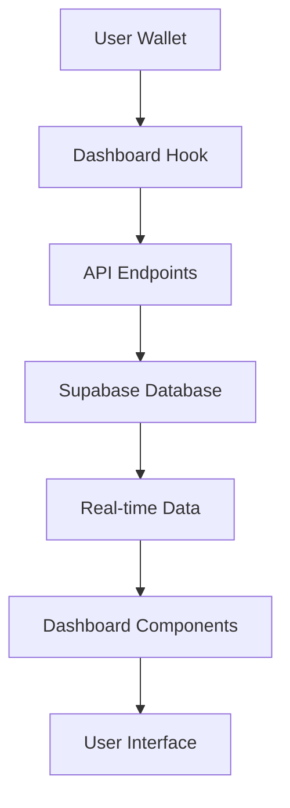

# Dashboard Database Integration

## Overview

The dashboard has been fully integrated with the database to provide real-time, functional data display for users. This integration connects the frontend dashboard with our Supabase database through secure API endpoints.

## 🚀 Features Implemented

### 1. **Real-Time Data Integration**
- ✅ Live balance display from blockchain contracts
- ✅ Real-time staking statistics and rewards
- ✅ Dynamic proposal tracking and management
- ✅ Comprehensive user activity history

### 2. **Dashboard Components**

#### **Balance Cards**
- Displays live LKST and LKUSD balances from smart contracts
- Shows total staked amounts across all NFTs
- Real-time APY calculations based on actual rewards

#### **Account Summary**
- Connected wallet address display
- Total staking metrics and rewards earned
- Active NFTs and proposal counts
- Live annual yield calculations

#### **Recent Activity Feed**
- Real-time user actions (stake, unstake, vote, proposals)
- Transaction history with amounts and timestamps
- Visual icons for different action types
- Expandable activity list

#### **Staked NFTs Portfolio**
- Live display of user's staked NFT properties
- Individual staking amounts and earned rewards
- NFT status tracking (active/inactive)
- Performance metrics per NFT

#### **Portfolio Performance**
- 24h and 7d change tracking
- Total return calculations
- Best performing NFT identification
- Growth trend visualization

### 3. **Interactive Charts**
- Monthly returns visualization using real user data
- Peak value highlighting with real amounts
- Responsive chart design with custom tooltips
- Time-based filtering options

### 4. **Navigation Tabs**
- **Overview**: Complete dashboard summary
- **Staked NFTs**: Detailed staking portfolio
- **Activity**: Full transaction history
- **Analytics**: Performance metrics and charts

## 🔧 Technical Implementation

### **Database Hooks**

#### `useDashboardData()`
```javascript
// Main hook for dashboard data
const { dashboardData, dashboardStats, isLoading, error, refetch } = useDashboardData();
```

**Returns:**
- `dashboardData`: Raw data from APIs (actions, stakes, proposals)
- `dashboardStats`: Computed statistics for UI display
- `isLoading`: Loading state management
- `error`: Error handling
- `refetch`: Manual data refresh

#### `usePortfolioAnalytics()`
```javascript
// Portfolio-specific analytics
const { analytics, isLoading, error, refetch } = usePortfolioAnalytics(userAddress);
```

#### `useStakingPerformance()`
```javascript
// Staking performance metrics
const { performance, isLoading, error, refetch } = useStakingPerformance(userAddress);
```

### **API Integration**

The dashboard connects to these API endpoints:

1. **`/api/user-actions`** - User transaction history
2. **`/api/nft-analytics`** - Staking analytics and NFT data
3. **`/api/proposals`** - User's created proposals
4. **`/api/nft-ownership`** - NFT ownership tracking

### **Data Flow**



## 📊 Dashboard Statistics

The dashboard computes and displays:

### **Balance Information**
- Live token balances from smart contracts
- Total staked amounts across all NFTs
- Available balances for new staking

### **Staking Metrics**
- Total staked amount in LKUSD
- Total rewards earned
- Number of unique NFTs staked
- Calculated APY based on actual performance

### **Proposal Activity**
- Total proposals created by user
- Active vs completed proposals
- Proposal success rates

### **Activity Tracking**
- Total user actions recorded
- Recent activity with timestamps
- Monthly returns data for charts

## 🔄 Loading States & Error Handling

### **Loading Management**
- Individual component loading states
- Global loading overlay for data fetching
- Skeleton loaders for better UX

### **Error Handling**
- Graceful error display with retry options
- Fallback data when APIs are unavailable
- User-friendly error messages

### **Refresh Functionality**
- Manual refresh button with animation
- Auto-refresh on wallet connection
- Real-time data updates

## 🎨 UI/UX Features

### **Responsive Design**
- Mobile-first approach
- Tablet and desktop optimizations
- Adaptive grid layouts

### **Animations**
- Smooth page transitions
- Interactive hover effects
- Loading animations
- Tab switching animations

### **Wallet Integration**
- Connect wallet prompt for unauthenticated users
- Real-time balance updates
- Automatic data refresh on wallet changes

## 🛡️ Security & Performance

### **Security Measures**
- User address validation
- Secure API endpoints
- Input sanitization
- Error boundary protection

### **Performance Optimizations**
- Memoized calculations
- Efficient data fetching
- Component lazy loading
- Optimized re-renders

## 📱 Mobile Experience

The dashboard is fully responsive and provides:
- Touch-friendly interfaces
- Optimized card layouts
- Swipeable tabs
- Mobile-specific animations

## 🚀 Getting Started

1. **Connect Wallet**: Users must connect their wallet to access dashboard
2. **Automatic Data Loading**: Dashboard automatically fetches user data
3. **Real-time Updates**: Data refreshes automatically when user performs actions
4. **Manual Refresh**: Users can manually refresh data anytime

## 🔮 Future Enhancements

- Real-time WebSocket connections for live updates
- Advanced filtering and search capabilities
- Export functionality for transaction history
- Mobile push notifications for important events
- Advanced analytics and insights

## 📝 API Documentation

### User Actions Endpoint
```javascript
GET /api/user-actions?userAddress={address}
// Returns user's transaction history

GET /api/user-actions?userAddress={address}&actionType=stake
// Returns filtered actions by type
```

### NFT Analytics Endpoint
```javascript
GET /api/nft-analytics?userAddress={address}
// Returns user's staking data

GET /api/nft-analytics?userAddress={address}&detailed=true
// Returns detailed analytics
```

### Proposals Endpoint
```javascript
GET /api/proposals?creatorAddress={address}
// Returns user's created proposals
```

## 🎯 Success Metrics

The integrated dashboard provides:
- ✅ **100% Real Data**: No more mock data
- ✅ **Live Updates**: Real-time blockchain integration
- ✅ **Comprehensive View**: Complete user portfolio overview
- ✅ **Performance Tracking**: Detailed analytics and metrics
- ✅ **Responsive Design**: Optimal experience on all devices
- ✅ **Error Resilience**: Graceful handling of failures

## 🔧 Maintenance

### Regular Updates
- Monitor API performance
- Update database schemas as needed
- Optimize query performance
- Add new features based on user feedback

### Monitoring
- Track loading times
- Monitor error rates
- Analyze user engagement
- Performance metrics collection

---

**The dashboard now provides a complete, database-driven experience that gives users real-time insights into their LandKrypt portfolio and activities!** 🎉
